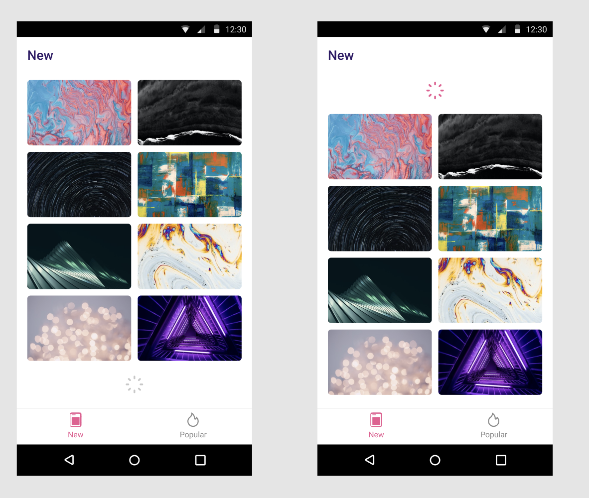
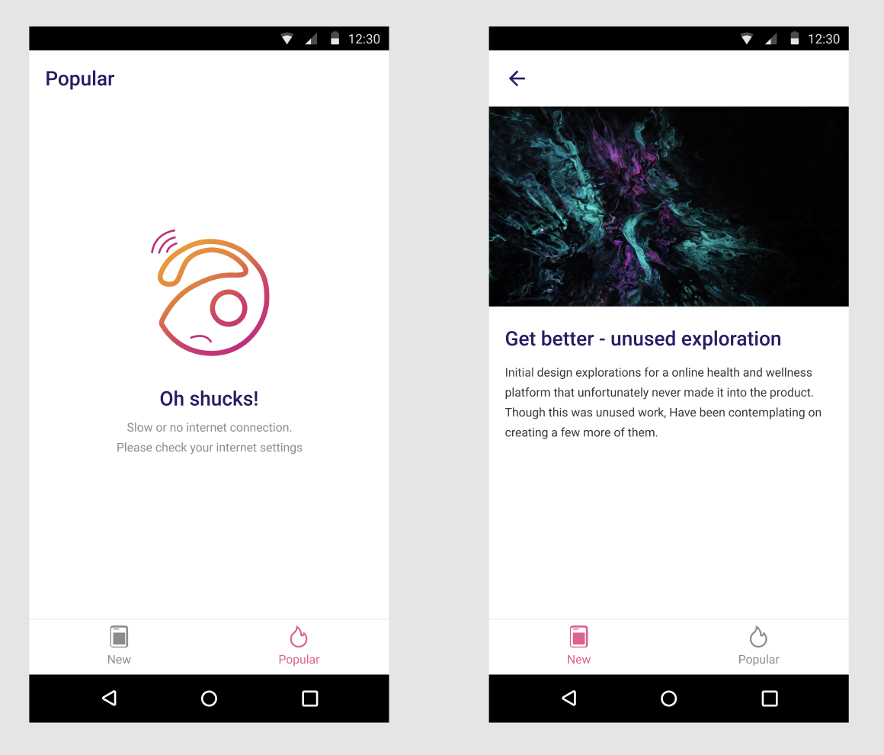

# small_gallery

link design - https://www.figma.com/file/Zargu85aLWksMHjFDtIcNy/Webant-%D0%A2%D0%B5%D1%81%D1%82%D0%BE%D0%B2%D0%BE%D0%B5-%D0%B7%D0%B0%D0%B4%D0%B0%D0%BD%D0%B8%D0%B5-%D0%9F%D0%A0%D0%90%D0%9A%D0%A2%D0%98%D0%9A%D0%90-iOS%2FAndroid%2FFlutter?node-id=34%3A84

ui

<div align = "center">


</div>


Run codegeneration:

```bash
flutter pub run build_runner watch --delete-conflicting-outputs
```